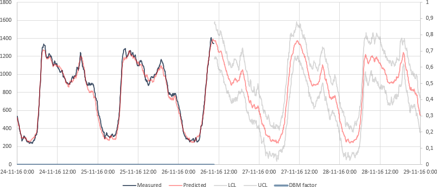
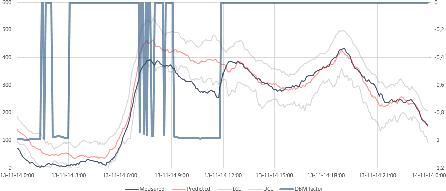

# DBM
Dynamic Bandwidth Monitor  
Leak detection method implemented in a real-time data historian

## Authors
| Name          | Company      | Role        | Contact                  |
| ------------- | ------------ | ----------- | ------------------------ |
| J.H. Fitié    | Vitens N.V.  | Lead author | johan.fitie@vitens.nl    |
| E.A. Trietsch | Vitens N.V.  | Co-author   | eelco.trietsch@vitens.nl |
|               | VORtech B.V. | Contributor |                          |

## Description
Water company Vitens has created a demonstration site called the Vitens Innovation Playground (VIP), in which new technologies and methodologies are developed, tested, and demonstrated. The projects conducted in the demonstration site can be categorized into one of four themes: energy optimization, real-time leak detection, online water quality monitoring, and customer interaction. In the real-time leak detection theme, a method for leak detection based on statistical demand forecasting was developed.

Using historical demand patterns and statistical methods - such as median absolute deviation, linear regression, sample variance, and exponential moving averages - real-time values can be compared to a predicted demand pattern and checked to be within calculated bandwidths. The method was implemented in Vitens’ realtime data historian, continuously comparing measured demand values to be within operational bounds.

One of the advantages of this method is that it doesn’t require manual configuration or training sets. Next to leak detection, unmeasured supply between areas and unscheduled plant shutdowns were also detected. The method was found to be such a success within the company, that it was implemented in an operational dashboard and is now used in day-to-day operations.

### Keywords
Real-time, leak detection, demand forecasting, demand patterns, operational dashboard

## Requirements
| Priority  | Requirement                                   | Version |
| --------- | --------------------------------------------- | ------- |
| Mandatory | Microsoft .NET Framework                      | 4       |
| Optional  | OSIsoft PI Software Development Kit (PI SDK)  |         |
| Optional  | OSIsoft PI Advanced Computing Engine (PI ACE) |         |

## Drivers
DBM uses drivers to read information from a source of data. The following drivers are included:

| Driver                  | Description                                                            | Identifier (`Point`)    | Remarks                                                                |
| ----------------------- | ---------------------------------------------------------------------- | ----------------------- | ---------------------------------------------------------------------- |
| `DBMDriverNull.vb`      | Returns zero for every request. Template for custom developed drivers. | None                    |                                                                        |
| `DBMDriverCSV.vb`       | Driver for CSV files (timestamp,value).                                | CSV filename (`String`) | Data interval must be the same as the `CalculationInterval` parameter. |
| `DBMDriverOSIsoftPI.vb` | Driver for OSIsoft PI.                                                 | `PISDK.PIPoint` object  |                                                                        |

## Parameters
DBM can be configured using several parameters. The values for these parameters can be changed at runtime in the `DBM.DBMParameters` class.

| Parameter                    | Default value | Units         | Description                                                                                             |
| ---------------------------- | ------------- | ------------- | ------------------------------------------------------------------------------------------------------- |
| `CalculationInterval`        | 300           | seconds       | Time interval at which the calculation is run.                                                          |
| `ComparePatterns`            | 12            | weeks         | Number of weeks to look back to predict the current value and control limits.                           |
| `EMAPreviousPeriods`         | 6             | intervals     | Number of previous intervals used to smooth the data.                                                   |
| `ConfidenceInterval`         | 0.99          | percent       | Confidence interval used for removing outliers and determining control limits.                          |
| `CorrelationPreviousPeriods` | 23            | intervals     | Number of previous intervals used to calculate prediction error correlation when an exception is found. |
| `CorrelationThreshold`       | 0.83666       | dimensionless | Absolute correlation lower limit for detecting (anti)correlation.                                       |

## Samples

### Sample 1 - Prediction

[Sample 1 data](docs/sample1.csv)

In this example, two days before and after the current day are shown. For historic values, the measured data (black) is shown along with the predicted value (red). The upper and lower control limits (gray) were not crossed, so the DBM factor value (blue) equals zero. For future values, the prediction is shown along with the upper and lower control limits. Reliable predictions can be made for at least seven days in advance.

```
Option Explicit
Option Strict
Module Module1
    Public Sub Main
        Dim _DBM As New DBM.DBM
        Dim _PISDK As New PISDK.PISDK
        Dim s,e As DateTime
        Dim r As New DBM.DBMResult
        s=DateAdd("d",-2,DateTime.Today)
        e=DateAdd("d",5,s)
        Do While s<e
            r=_DBM.Calculate(New DBM.DBMPointDriver(_PISDK.Servers("sr-16635").PIPoints("ACE-FR-Deelbalansgebied-Leeuwarden-levering")),Nothing,s)
            Console.WriteLine(s.ToString & vbTab & r.Factor & vbTab & r.CurrValue & vbTab & r.PredValue & vbTab & r.LowContrLimit & vbTab & r.UppContrLimit)
            s=DateAdd("s",DBM.DBMParameters.CalculationInterval,s)
        Loop
    End Sub
End Module
```

### Sample 2 - Exception

[Sample 2 data](docs/sample2.csv)

In this example, an exception causes the measured value (black) to cross the upper control limit (gray). The DBM factor value (blue) is greater than one during this time (calculated as _(measured value - predicted value)/(upper control limit - predicted value)_).

```
Option Explicit
Option Strict
Module Module1
    Public Sub Main
        Dim _DBM As New DBM.DBM
        Dim _PISDK As New PISDK.PISDK
        Dim s,e As DateTime
        Dim r As New DBM.DBMResult
        s=New DateTime(2013,3,12)
        e=DateAdd("d",1,s)
        Do While s<e
            r=_DBM.Calculate(New DBM.DBMPointDriver(_PISDK.Servers("sr-16635").PIPoints("ACE-FR-Deelbalansgebied-Leeuwarden-levering")),Nothing,s)
            Console.WriteLine(s.ToString & vbTab & r.Factor & vbTab & r.CurrValue & vbTab & r.PredValue & vbTab & r.LowContrLimit & vbTab & r.UppContrLimit)
            s=DateAdd("s",DBM.DBMParameters.CalculationInterval,s)
        Loop
    End Sub
End Module
```

### Sample 3 - Suppressed exception (correlation)


[Sample 3 data](docs/sample3.csv)

In this example, an exception causes the measured value (black) to cross the upper and lower control limits (gray). Because the pattern is checked against a similar pattern which has a comparable relative prediction error (calculated as _(predicted value / measured value) - 1_), the exception is suppressed. The DBM factor value is greater than zero and less than, or equal to one (correlation coefficient of the relative prediction error) during this time.

```
Option Explicit
Option Strict
Module Module1
    Public Sub Main
        Dim _DBM As New DBM.DBM
        Dim _PISDK As New PISDK.PISDK
        Dim s,e As DateTime
        Dim r As New DBM.DBMResult
        Dim CP As New Collections.Generic.List(Of DBM.DBMCorrelationPoint)
        s=New DateTime(2016,1,1)
        e=DateAdd("d",1,s)
        CP.Add(New DBM.DBMCorrelationPoint(New DBM.DBMPointDriver(_PISDK.Servers("sr-16634").PIPoints("Reinwaterafgifte")),False))
        Do While s<e
            r=_DBM.Calculate(New DBM.DBMPointDriver(_PISDK.Servers("sr-16635").PIPoints("ACE-FR-Deelbalansgebied-Leeuwarden-levering")),CP,s)
            Console.Write(s.ToString & vbTab & r.Factor & vbTab & r.CurrValue & vbTab & r.PredValue & vbTab & r.LowContrLimit & vbTab & r.UppContrLimit & vbTab)
            Console.Write(r.AbsErrorStats.Count & vbTab & r.AbsErrorStats.Slope & vbTab & r.AbsErrorStats.Angle & vbTab & r.AbsErrorStats.Intercept & vbTab & r.AbsErrorStats.StDevSLinReg & vbTab & r.AbsErrorStats.Correlation & vbTab & r.AbsErrorStats.ModifiedCorrelation & vbTab & r.AbsErrorStats.Determination & vbTab)
            Console.Write(r.RelErrorStats.Count & vbTab & r.RelErrorStats.Slope & vbTab & r.RelErrorStats.Angle & vbTab & r.RelErrorStats.Intercept & vbTab & r.RelErrorStats.StDevSLinReg & vbTab & r.RelErrorStats.Correlation & vbTab & r.RelErrorStats.ModifiedCorrelation & vbTab & r.RelErrorStats.Determination & vbTab)
            r=_DBM.Calculate(CP.Item(0).DBMPointDriver,Nothing,s)
            Console.WriteLine(r.CurrValue & vbTab & r.PredValue & vbTab & r.LowContrLimit & vbTab & r.UppContrLimit)
            s=DateAdd("s",DBM.DBMParameters.CalculationInterval,s)
        Loop
    End Sub
End Module
```

### Sample 4 - Suppressed exception (anticorrelation)


[Sample 4 data](docs/sample4.csv)

In this example, an exception causes the measured value (black) to cross the lower control limit (gray). Because the pattern is checked against a similar, adjacent, pattern which has a comparable, but inverted, absolute prediction error (calculated as _predicted value - measured value_), the exception is suppressed. The DBM factor value is less than zero and greater than, or equal to negative one (correlation coefficient of the absolute prediction error) during this time.

```
Option Explicit
Option Strict
Module Module1
    Public Sub Main
        Dim _DBM As New DBM.DBM
        Dim _PISDK As New PISDK.PISDK
        Dim s,e As DateTime
        Dim r As New DBM.DBMResult
        Dim CP As New Collections.Generic.List(Of DBM.DBMCorrelationPoint)
        s=New DateTime(2014,11,13)
        e=DateAdd("d",1,s)
        CP.Add(New DBM.DBMCorrelationPoint(New DBM.DBMPointDriver(_PISDK.Servers("sr-16635").PIPoints("ACE-FR-Deelbalansgebied-Oosterwolde-levering")),False))
        Do While s<e
            r=_DBM.Calculate(New DBM.DBMPointDriver(_PISDK.Servers("sr-16635").PIPoints("ACE-FR-Deelbalansgebied-Drachten-levering")),CP,s)
            Console.Write(s.ToString & vbTab & r.Factor & vbTab & r.CurrValue & vbTab & r.PredValue & vbTab & r.LowContrLimit & vbTab & r.UppContrLimit & vbTab)
            Console.Write(r.AbsErrorStats.Count & vbTab & r.AbsErrorStats.Slope & vbTab & r.AbsErrorStats.Angle & vbTab & r.AbsErrorStats.Intercept & vbTab & r.AbsErrorStats.StDevSLinReg & vbTab & r.AbsErrorStats.Correlation & vbTab & r.AbsErrorStats.ModifiedCorrelation & vbTab & r.AbsErrorStats.Determination & vbTab)
            Console.Write(r.RelErrorStats.Count & vbTab & r.RelErrorStats.Slope & vbTab & r.RelErrorStats.Angle & vbTab & r.RelErrorStats.Intercept & vbTab & r.RelErrorStats.StDevSLinReg & vbTab & r.RelErrorStats.Correlation & vbTab & r.RelErrorStats.ModifiedCorrelation & vbTab & r.RelErrorStats.Determination & vbTab)
            r=_DBM.Calculate(CP.Item(0).DBMPointDriver,Nothing,s)
            Console.WriteLine(r.CurrValue & vbTab & r.PredValue & vbTab & r.LowContrLimit & vbTab & r.UppContrLimit)
            s=DateAdd("s",DBM.DBMParameters.CalculationInterval,s)
        Loop
    End Sub
End Module
```

## Classes


## About Vitens


Vitens is the largest drinking water company in The Netherlands. We deliver top quality drinking water to 5.6 million people and companies in the provinces Flevoland, Fryslân, Gelderland, Utrecht and Overijssel and some municipalities in Drenthe and Noord-Holland. Annually we deliver 350 million m³ water with 1,400 employees, 100 water treatment works and 49,000 kilometres of water mains.

One of our main focus points is using advanced water quality, quantity and hydraulics models to further improve and optimize our treatment and distribution processes.

https://www.vitens.nl/

## License
DBM  
Dynamic Bandwidth Monitor  
Leak detection method implemented in a real-time data historian

Copyright (C) 2014, 2015, 2016 J.H. Fitié, Vitens N.V.

This program is free software: you can redistribute it and/or modify it under the terms of the GNU General Public License as published by the Free Software Foundation, either version 3 of the License, or (at your option) any later version.

This program is distributed in the hope that it will be useful, but WITHOUT ANY WARRANTY; without even the implied warranty of MERCHANTABILITY or FITNESS FOR A PARTICULAR PURPOSE.  See the GNU General Public License for more details.

You should have received a copy of the GNU General Public License along with this program.  If not, see <http://www.gnu.org/licenses/>.


